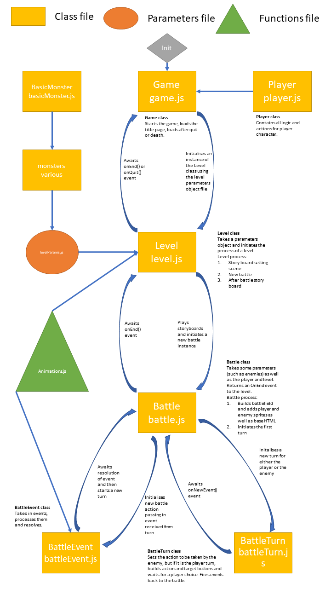

# Welcome to the Dungeon of Doom
### Overview

---

A dark and gritty story rich battling game inspired by classic JRPGs like Final Fantasy. You take the role of the nameless protagonist who must quest to save his (or her) family. The tone is deliberately dark and macabre, bringing it into line with more modern games such as Dark Souls.

The game has 3 levels with transitional scenes between each as well as a prologue and epilogue.

### Game Link

---

https://will-j-c.github.io/dungeonofdoom/

### Tech Stack

---

- HTML
- CSS
- JavaScript

### Frameworks

---

- Bootstrap
- Green Sock Animations (GSAP)

### Approach

---

I wanted to use OOP as the principle programing paradigm as it is something I am unfamiliar with and presented an opportunity for a challenge and learning experience. 

I initially considered a cute, pixel art game in the style of Pokemon but graduated to a darker tone when I started exploring art assets.

My initial wire frames were done in HTML. I used Bootstrap as it allowed for a simple grid system to form the main battlefield play area, with additional rows below for action buttons. 

After this I just started coding. Big mistake! After several hours I had coded myself into a corner and could not work out how to advance. Youtube to the rescue!

https://www.youtube.com/watch?v=xfCPZhMw5Z0&ab_channel=DrewConley

The above video was instrumental in the structure of the game. Although difficult to follow at first, just trying to follow along and having some perseverance :persevere: meant slow but steady gains and built my confidence. I've included an image at the end of the readme file that maps out all the logic and how the whole game holds together. I wanted to do this to better visualise the structure and hold things in place in my head as I scaled things.

I was initially going to animate with Animate.css. Although it is a great tool and super easy to use, CSS animations were just not going to cut it for all the nuances of battle and being mobile responsive. Therefore, GSAP was the tool of choice as it it easy to grasp the basics (although hideously difficult to master) and incredibly powerful. Great fun to use as well as you start to think of all the wacky things that you can achieve with it!

Making it mobile responsive was relatively straightforward with Bootstrap but it isn't perfect and took a lot of trial and error. Ultimately, the user experience is much better on a bigger screen. 

Overall, the project was satisfying but a lot of work. It hammered home the importance of planning and having a clear strategy before just starting to code.
 
### Instructions

---

Load the game, choose to start with the prologue or dive into the first chapter and go from there! The button interface is self-explanatory. Enjoy!

### Additional Feature Ideas

---

- Add a special attack (or two!) for each enemy and logic to determine which attack they use
- Add a leveling system for the player
- Introduce more items (such as bombs, different kinds of potions)
- Add status effects and weaknesses
- Add after battle loot screen

###### Copyright/Attribution Notices

---

"The Precipice of Victory" Composed by Jonathan Shaw (www.jshaw.co.uk)
Art set by MedicineStorm http://opengameart.org/content/dungeon-crawl-32x32-tiles

###### Appendix

---

